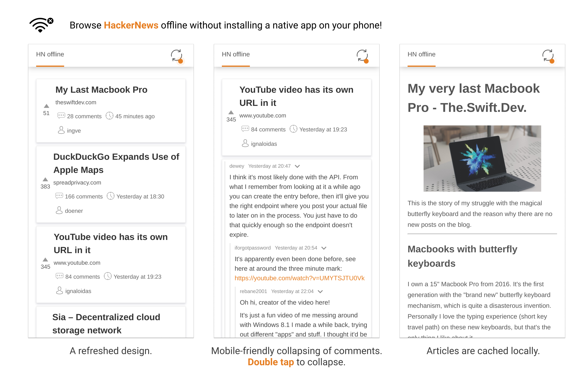

# hn-offline

**[See it in action](https://hn-offline.albert-koczy.com/)**

hn-offline is an offline-first client for hackernews that even fetches the article contents for reading on the go. Firstly it downloads the data from HackerNews via the API along with the article contents scraped using [Readability](https://github.com/mozilla/readability) (the library used by the reader mode in Firefox). Everything is then saved into IndexedDB via a service worker for later consumption when offline.

# Tech stack

The app uses [preact](https://preactjs.com/) for rendering the front-end. The whole thing is written in TypeScript. In addition I use css-modules with less for better minification of class names. Everything is held together in a bundle with webpack. On every commit to master the app is deployed and hosted using now [now](https://zeit.co/now).

# Caveats

Currently the `readability-proxy` is hosted on [now](https://zeit.co/now) using a lambda which means that the articles are fetched with a simple http client. This causes some websites (most notably [bloomberg](https://www.bloomberg.com/europe)) to block the proxy and show a captcha which cannot be solved by it.

Additionally the proxy currently does not relay images, it only hotlinks them. This means that when using the app offline no pictures will be displayed. I plan on adding images to the scraper but only for a self-hosted version since I have no resources to pay for the bandwidth. Sorry for that.

# Roadmap

- [ ] Add better content to the sync dropdown
- [ ] Add sane error handling with retries
- [ ] Add links to the original article when viewing the offline version
- [ ] Dark theme
- [ ] Images in readability-proxy.
- [ ] Caching of comments based of descendants count

# License

GNU AFFERO GENERAL PUBLIC LICENSE. See [LICENSE](license).